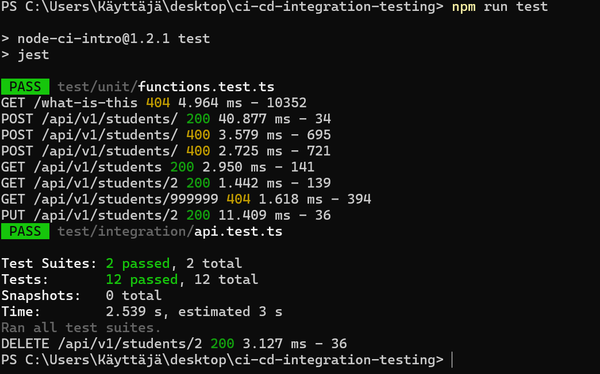
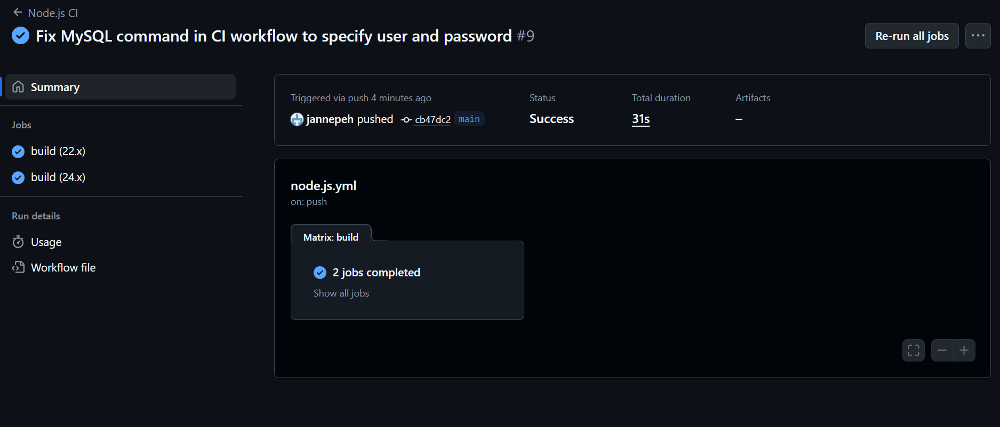

# Simple Node CI/CD demo including integration testing

Tests & code based on <https://github.com/ilkkamtk/integration-testing-ready>

## Testing Scenarios

Testing successful API responses and error handling. The test cases for both scenarios are provided in the test folder.

## 1. Prerequisites

1. Create a new repository using this as a template (click _Use this template_ button on top of the main page of [this repository](https://github.com/mattpe/node-ci-intro))
1. Clone the repo and install dependencies with `npm install`
1. Create a database and a user for the application (example script: [db/create-db.sql](./db/create-db.sql))
    - NOTE: default username and password should be changed and not shared publicly in the repo, use environment variables instead
1. Create `.env` file in the root of the project (see `.env.example` for reference)
1. Run tests with `npm test` locally and make sure they pass

